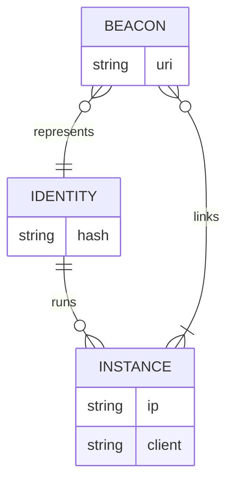

# Sketchpad

## System Diagram

Just a stub to check if mermaid works

```mermaid
erDiagram
	IDENTITY {
		string hash
	}
	INSTANCE {
		string ip
		string client
	}
	BEACON {
		string uri
	}
	IDENTITY ||--o{ INSTANCE : runs
	BEACON }o--|{ INSTANCE : links
	BEACON }o--|| IDENTITY : represents

```

## Graph Data Model

- Triplets
- Containers
- Codecs
